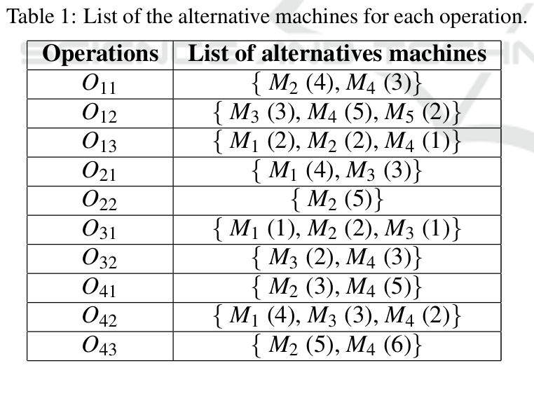

# KHARBOUCHE BILAL MIAAD bilal.kharbouche99@gmail.com

i use the data.txt 
# Python implementation of a genetic algorithm for FJSP.

Based on a paper written by Xinyu Li and Liang Gao [1].


## Code structure

The code has been designed to be read along the section 4 of this paper.

- Workflow of the proposed HA (4.1)
    - main.py
- Encoding and decoding (4.2)
    - encoding.py, decoding.py
- Genetic operators (4.3)
    - genetic.py
- Local search by tabu search (4.4)
    - This section has been ignored
- Terminate criteria (4.5)
    - termination.py

## Usage

To run the algorithm on the Mk02 problem from the Brandimarte data:

```
$ python3 main.py data.txt 
```
Test data from this article [this site](https://www.researchgate.net/publication/369016034_A_Bi-Level_Genetic_Algorithm_to_Solve_the_Dynamic_Flexible_Job_Shop_Scheduling_Problem?enrichId=rgreq-405d8f6fb6cba496c67d9ceea01d93aa-XXX&enrichSource=Y292ZXJQYWdlOzM2OTAxNjAzNDtBUzoxMTQzMTI4MTEyNTE0NjY2NUAxNjc4MjE0OTY3MzM2&el=1_x_3&_esc=publicationCoverPdf).


Test data can be found on [this site](http://people.idsia.ch/~monaldo/fjsp.html).

## References 

[1] Xinyu Li and Liang Gao. An effective hybrid genetic algorithm and tabu searchfor  flexible  job  shop  scheduling  problem.International  Journal  of  ProductionEconomics, 174 :93 – 110, 2016